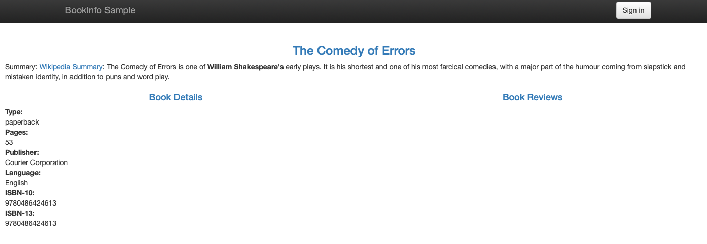




<br/><br/>


# Práctica creativa 2:
# Despliegue de una aplicación escalable

## Objetivos

Creación de un escenario completo de despliegue de una aplicación fiable y escalable que integre los diversos contenidos impartidos en la asignatura. Para ello se usarán múltiples tecnologías. Esta práctica está orientada a afianzar los conocimientos adquiridos a lo largo de la asignatura con respecto a los temas relacionados, con el despliegue de aplicaciones en la nube y aplicaciones basadas en microservicios utilizando Docker y Kubernetes. Para ello, se definen una serie de tareas a realizar definidas en cuatro grandes bloques.

- Despliegue de una aplicación monolítica en una máquina virtual en google cloud y/o el escenario de la **práctica creativa 1**.
- Despliegue de una aplicación monolítica usando docker.
- Segmentación de una aplicación monolítica en microservicios utilizando docker-compose.
- Despliegue de una aplicación basada en microservicios utilizando Kubernetes. 

## Descripción

La aplicación que se va a desplegar en esta práctica ya ha sido desarrollada y está disponible en el siguiente repositorio de git: <https://github.com/CDPS-ETSIT/practica_creativa2.git>

```
git clone https://github.com/CDPS-ETSIT/practica_creativa2.git
```

En esta práctica, el alumno evaluará diferentes tecnologías para desplegar la aplicación, de forma que sea capaz de identificar los problemas y soluciones que se derivan del uso de cada una de ellas. El objetivo es que el alumno sea capaz de comprender y usar cada una de las tecnologías en entornos de tipo “dev-ops” para el desarrollo de aplicaciones “full-stack” con un enfoque ágil, tal como demanda la industria actualmente.

## 1. Despliegue de la aplicación en máquina virtual pesada  (2 puntos)

En esta parte, se utilizarán las técnicas más tradicionales, que consisten en desplegar la aplicación como si fuese un monolito, en una o varias máquinas virtuales pesadas. 

Para ello deberá programar un script en lenguaje Python que sea capaz de realizar una de las siguientes instalaciones: 

- Instalación de la aplicación en una máquina virtual pesada alojada en la infraestructura de google cloud (no tiene que automatizarse la creación de la máquina virtual).
- Instalación de la aplicación en los servidores s1 a s3 de la práctica creativa 1 (alternativamente usar una máquina virtual fuera del escenario como las de las primeras prácticas). 

En el directorio `bookinfo/src/productpage` se encuentra el código de una aplicación que muestra la información sobre libros escrita en Python3. Esta aplicación se ejecuta llamando al fichero `productpage_monolith.py`y especificando el puerto en el que queremos que la aplicación reciba las peticiones (**puerto 9080**).  Previamente se deben instalar, usando pip3, las dependencias especificadas en el fichero `requirements.txt`.

- Se pide inspeccionar el código de la aplicación para que en el título de la página aparezca el nombre del grupo que está realizando la práctica. Este valor deberá obtenerse por medio de la variable de entorno `<GROUP_NUM>`. También deberá arrancar la aplicación en un puerto diferente al predeterminado.

- Se requiere que la aplicación sea accesible desde el exterior por medio de la IP pública que tenga asignada la VM, por ejemplo:
`http://<ip-publica>:<puerto>/productpage`



Llegados a este punto la Web se encuentra operativa. Sin embargo, aunque está aplicación está desarrollada de forma monolítica, está compuesta por dos servicios: Un servicio para la página de productos y otro para la descripción de los productos. 

Una descripción gráfica de cómo está compuesta la aplicación es la siguiente: 


**Nota:** Al menos uno de los scripts debe de realizar la instalación dentro de la máquina virtual. 

## Despliegue de una aplicación monolítica usando docker (2 puntos).

Una vez que ya se ha ejecutado la aplicación y se puede acceder a ella, se pide que despliegue la misma aplicación, pero en este caso usando docker. Se utilizará un único fichero Dockerfile que desplegaremos bien en local (siguiendo la nomenclatura que se indica) o bien usando docker-hub para el registro de imágenes. Al final tendremos una solución similar a la del apartado anterior, pero usando tecnología de virtualización ligera. 

Para esta parte es necesario:

- Definir el fichero `Dockerfile` para ejecutar la aplicación web en el puerto `5080`
- Crear la imagen de docker usando el siguiente formato: 
`product-page/<numero_de_grupo>` donde `product-page` es el nombre del servicio por lo que no es necesario cambiarlo a diferencia de `<numero_de_grupo>`

- Pasar la variable de entorno `<GROUP_NUM>` al contenedor para que se muestre en el título de la página (en la etiquéta “title” de la página html servida) el número del grupo.

Arrancar el contenedor con el nombre siguiendo el siguiente formato `<nombre_del_servicio>-<numero_de_grupo>` y que la web sea accesible desde el exterior.

El contenedor puede ejecutarse en una instalación local de docker en vuestro ordenador, en los ordenadores del laboratorio, en una máquina virtual de google cloud, o en el servicio de play-with-docker (recordar que en este último se reinicia la máquina cada 4 horas). 

En ejemplo del comando a ejecutar sería el siguiente:

```
docker run --name product-page-g45 -p 9080:9080 -e GROUP_NUM=45 -d product-page/g45
```

Podeis usar de imagen base `python:3.7.7-slim` 

## Segmentación de una aplicación monolítica en microservicios utilizando docker-compose ( 2 puntos)

Como se comentó anteriormente, la aplicación de esta práctica consta de dos servicios desarrollados en Python. Sin embargo, para su puesta en ejecución, se utilizó un único contenedor. En esta parte de la práctica se va a utilizar un enfoque orientado a microservicios. Para ello, se va a segmentar la aplicación, separando cada servicio para que funcione de forma independiente. 
Además, se van a añadir dos servicios más: **Reviews** y **Ratings**. La siguiente figura ilustra cómo se compone la aplicación en microservicios.


Como puede observar en la figura, se va a considerar una aplicación **“políglota”**, donde cada uno los microservicios que componen la aplicación está desarrollado en un lenguaje de programación distinto. La aplicación se compone de los siguientes microservicios:

- Product Page (Python)
- Details (Ruby)
- Reviews (Java) - Existen tres versiones de este servicio: la primera muetra las reviews sin estrellas, la segunda con estrellas de color negro y la tercera con estrellas de color rojo.
- Ratings (NodeJS)

Se pide:

- Definir un fichero Dockerfile para cada uno de los servicios listados anteriormente.
- Crear las imágenes de cada uno de los servicios de acuerdo al siguiente formato de nombre: `<nombre_de_microservicio>/<numero_de_grupo>` (Incluir la creación de las tres versiones del servicio de reviews. Para especificar la versión se hace uso de la variable de entorno `SERVICE_VERSION` cuyos valores pueden ser **v1**, **v2** o **v3**)
- Definir un fichero docker-compose para desplegar cada uno de los contenedores cuyas imágenes fueron creadas anteriormente, recordando mantener las variables de entorno correspondientes. El nombre de cada contenedor debe ser definido de acuerdo a la siguiente convención `<nombre_del_servicio>-<numero_de_grupo>`. Se recomienda fuertemente el uso de volúmenes para ejecutar los ficheros de cada uno de los servicios.
- La web debe ser completamente funcional y accesible desde el exterior.
- Asimismo, la web debe funcionar con las tres versiones del microservicio **review**. Para ello, se harán pruebas con cada una de las versiones de dichos contenedores. Sin embargo, solo una versión puede estar activo y ejecutándose a la vez

Consideraciones especiales para la definición de los ficheros `Dockerfile` de cada uno de los microservicios:

- **ProductPage:** para este contenedor se debe usar la imagen base de python3, instalar las librerías definidas en el fichero requirements.txt y ejecutar el archivo productpage.py.

- **Details**: 
  - Imagen base a utilizar `ruby:2.7.1-slim`
  - Copiar el fichero details.rb en la ruta `/opt/microservices/` dentro del contenedor
  - Especificar dos variables de entorno: `SERVICE_VERSION` con valor **v1** y `ENABLE_EXTERNAL_BOOK_SERVICE` con valor true
  - Exponer el puerto **9080** 
  - Ejecutar el fichero `details.rb` usando la instrucción ruby y añadir el puerto ex: `[“ruby”,”fichero”,”puerto”]`

- **Reviews**: 
  - Compilar y empaquetar los ficheros necesarios ejecutando, dentro de la ruta `src/reviews`, el siguiente comando: 
    ```
    docker run --rm -u root -v "$(pwd)":/home/gradle/project -w /home/gradle/project gradle:4.8.1 gradle clean build
    ```
- Construir la imagen utilizando el fichero Dockerfile alojado en el directorio `src/reviews/reviews-wlpcfg` (Inspeccionar el contenido para asignar bien las rutas y variables de entorno). No olvidar respetar la convención de nombres de los contenedores.

Al construir el fichero docker-compose, añadir la variable de entorno `ENABLE_RATINGS=true` para que se muestren los ratings.

- **Ratings**: 
  - Imagen base a utilizar `node:12.18.1-slim`
  - Copiar los ficheros `package.json` y `ratings.js` a la ruta `/opt/microservices/` dentro del contenedor.
  - Especificar la variable de entorno `SERVICE_VERSION` con valor **v1**
  - Instalar las dependencias
  - Exponer el puerto **9080** 
  - Ejecutar el fichero `ratings.js`, usando la instrucción node y añadir el puerto ex: `[“node”,”ratings.js”,”puerto”]`


Incluya en la memoria de la práctica las diferencias con la versión de un único contenedor. 

## Despliegue de una aplicación basada en microservicios utilizando Kubernetes (4 puntos) 

Llegados a este punto y con todas las imágenes de docker creadas, es hora de realizar el despliegue de la aplicación utilizando Kubernetes. Recordad que puede utilizarse Kubernetes en un ordenador personal, utilizando minikube, o bien usando play-with-kubernetes (recordando que cada hora se reinicializa la máquina virtual)

Para esta parte de la práctica será necesario:

- Crear un cluster de Kubernetes en GKE con **3** nodos sin **autoescalado**
- Definir archivos de despliegue individuales para cada uno de los microservicios de la aplicación. Es decir, cada microservicio se debe ejecutar en **un pod** y cada pod debe tener únicamente **un contenedor** asociado.
- Definir como **factor de replicación 3** para el microservicio de **Details** y **factor de replicación 2** para el microservicio de **Ratings**.
- Definir los services necesarios para que todos los servicios se comuniquen entre sí
- Definir un service que permita acceder por medio de una **IP externa** a la aplicación por medio del microservicio **productpage**.

Para las tareas descritas anteriormente, se provee dentro de la carpeta `platform/kube` los ficheros `review-<version>-<tipo>.yaml` y `ratings.yml`, que contienen la declaración tanto de los servicios como de los deployments necesarios para cada una de las versiones del microsevicios de **Reviews** y **Ratings**. Estos ficheros pueden ser usados como ejemplo para desplegar los microservicios restantes.

Incluya en la memoria de la práctica las diferencias que encuentra al crear los pods, así mismo la diferencia que ve para escalar esta última solución. 

**Parte opcional:**

- Desplegar usando [Helm Charts](<https://helm.sh> )  toda la infraestructura de la práctica.


## Entrega

Los alumnos deberán entregar un fichero comprimido **(zip)** en el que se incluyan los scripts y ficheros de configuración utilizados, así como un documento breve en el que se describan las principales decisiones de diseño e implementación tomadas, la forma de instalar y configurar los servicios, así como las partes opcionales implementadas. Adicionalmente, se incluirá también una breve discusión sobre los puntos débiles de la arquitectura en cuanto a fiabilidad y escalabilidad, mencionando alguna solución a los problemas detectados.

En el examen oral de la práctica (cuyas fechas y turnos se publicarán en el moodle de la asignatura) se evaluará el correcto funcionamiento del servicio, la calidad de la solución adoptada en relación con los requisitos definidos en este documento y el conocimiento de los alumnos de las técnicas y herramientas usadas en el desarrollo de este trabajo. 
